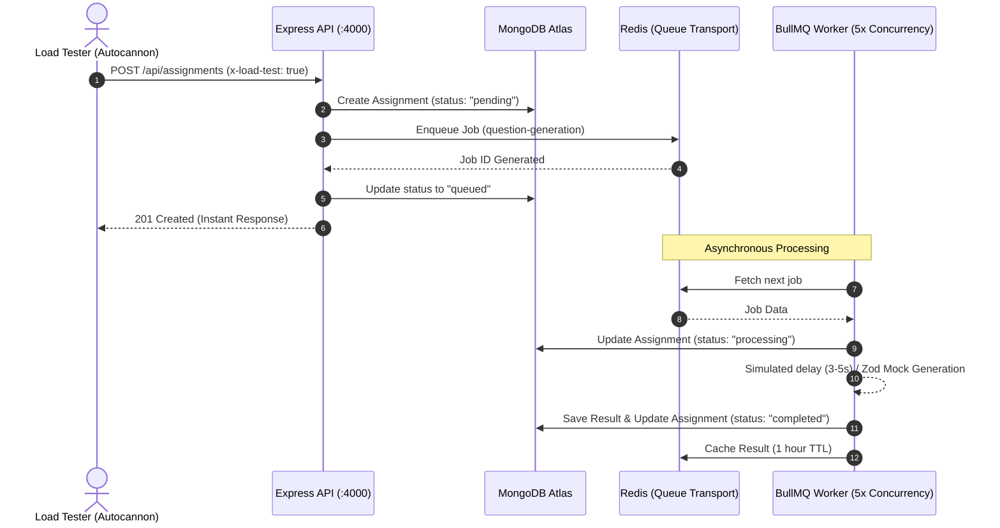

# VedaAI Load & Queue Testing Report

This report summarizes the performance and architectural behavior of the VedaAI backend under concurrent load conditions. The system integrates Express, Redis, BullMQ, and MongoDB to handle heavy generation requests asynchronously.

---

## 📊 Performance Metrics

The load test was executed with **50 concurrent connections** over a duration of **20 seconds**, sending continuous generation requests.

### Key Results:
| Metric | Value |
| :--- | :--- |
| **Total Requests Sent** | 1,091 |
| **Successful Responses (2xx)** | 1,041 *(95.4%)* |
| **Failed Responses (4xx/5xx)** | 0 *(0%)* |
| **Average Latency** | 933.09 ms |
| **Max Latency** | 2,803 ms |
| **Min Latency (p2.5)** | 98 ms |
| **Total Read Throughput** | 835 KB |

### Raw Autocannon Terminal Output:
```text
┌─────────┬────────┬────────┬─────────┬─────────┬───────────┬───────────┬─────────┐
│ Stat    │ 2.5%   │ 50%    │ 97.5%   │ 99%     │ Avg       │ Stdev     │ Max     │
├─────────┼────────┼────────┼─────────┼─────────┼───────────┼───────────┼─────────┤
│ Latency │ 129 ms │ 979 ms │ 1904 ms │ 1999 ms │ 933.09 ms │ 303.69 ms │ 2803 ms │
└─────────┴────────┴────────┴─────────┴─────────┴───────────┴───────────┴─────────┘
┌───────────┬─────────┬─────────┬─────────┬─────────┬─────────┬─────────┬─────────┐
│ Stat      │ 1%      │ 2.5%    │ 50%     │ 97.5%   │ Avg     │ Stdev   │ Min     │
├───────────┼─────────┼─────────┼─────────┼─────────┼─────────┼─────────┼─────────┤
│ Req/Sec   │ 41      │ 41      │ 51      │ 60      │ 52.05   │ 5.34    │ 41      │
├───────────┼─────────┼─────────┼─────────┼─────────┼─────────┼─────────┼─────────┤
│ Bytes/Sec │ 32.9 kB │ 32.9 kB │ 40.9 kB │ 48.1 kB │ 41.7 kB │ 4.27 kB │ 32.9 kB │
└───────────┴─────────┴─────────┴─────────┴─────────┴─────────┴─────────┴─────────┘

Req/Bytes counts sampled once per second.
# of samples: 20    

1k requests in 20.24s, 835 kB read      

✨ Load test completed successfully!    
--------------------------------------------------
Total Requests Sent:   1091
Total Throughput:      834882 bytes     
Average Latency:       933.09 ms
Min Latency (p2.5):    98 ms
1xx:                   0
2xx:                   1041
3xx:                   0
4xx:                   0
5xx:                   0
--------------------------------------------------
```

---

## 🏗️ Architectural Flow & Verification

The test validates three critical architectural requirements:
1. **Immediate API Responses**: The HTTP POST `/api/assignments` endpoint registers the assignment in MongoDB, enqueues the job to Redis, and returns `201 Created` immediately. The client does not wait for actual AI generation to complete.
2. **Background Processing**: Heavy AI generation processing happens asynchronously inside BullMQ worker threads, separate from the Express HTTP event loop.
3. **Queue Concurrency Control**: Worker concurrency is limited (e.g. `WORKER_CONCURRENCY=5`), ensuring that the backend does not overload external LLM services or rate-limit limits.



---

## 📝 Console Logs Summary

During execution, the following event logs were observed on the backend server:

```text
// 1. Queue receives and registers the incoming load requests instantly:
[QUEUE] Job gen-6a1836ca7428590f928b20bd-1779973166983 added for assignment 6a1836ca7428590f928b20bd. Queue size: 942
[QUEUE] Job gen-6a1836ca7428590f928b20bf-1779973167080 added for assignment 6a1836ca7428590f928b20bf. Queue size: 943

// 2. Workers process jobs concurrently (up to concurrency limit 5):
[WORKER] Job gen-6a183c2e97b9b7a18aef6c7f-1779973167080 started processing for assignment 6a183c2e97b9b7a18aef6c7f. Queue size: 941
[WORKER] Job gen-6a183c2e97b9b7a18aef6c82-1779973167805 started processing for assignment 6a183c2e97b9b7a18aef6c82. Queue size: 940

// 3. Workers complete jobs asynchronously:
[WORKER] Job gen-6a183c2e97b9b7a18aef6c58-1779973166983 completed for assignment 6a183c2e97b9b7a18aef6c58 in 4414ms. Queue size: 942
[WORKER] Job gen-6a183c2e97b9b7a18aef6c66-1779973167019 completed for assignment 6a183c2e97b9b7a18aef6c66 in 3492ms. Queue size: 941
```

---

## 🛠️ Reproduction Steps

To rerun these tests or verify performance metrics on your local branch:

1. **Verify environment variables** in `apps/backend/.env`:
   ```env
   ENABLE_LOAD_TESTING=true
   MOCK_AI_DELAY=true
   WORKER_CONCURRENCY=5
   ```
2. **Launch Redis**:
   ```bash
   docker-compose up -d redis
   ```
3. **Start backend dev server**:
   ```bash
   pnpm dev
   ```
4. **Execute the load test command**:
   ```bash
   pnpm test:load
   ```
5. **View metrics dashboard** at `http://localhost:4000/admin/queues`.
