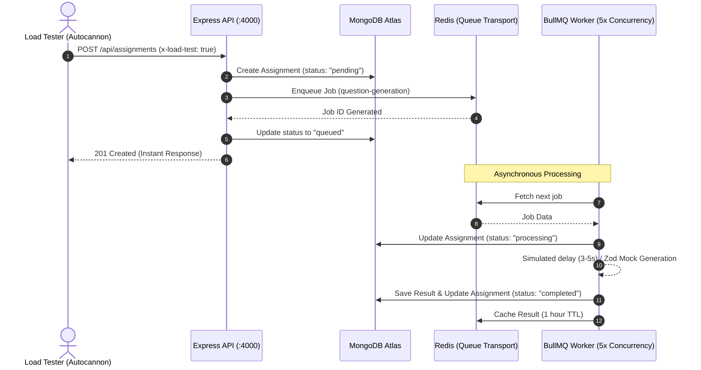

# **Submission**

### **Submission Link : [Submit here](https://docs.google.com/forms/d/e/1FAIpQLSeL19GVvVT8vZrTx67hMWKTXLyJSyhkW5XGyzh7Ppt5w8P1jw/viewform?usp=dialog)**

### **Live Deployment Link : [VedaAI Production App](https://vedaai-1w09.onrender.com)**

---

### **1. GitHub Repo**

- **GitHub Repository**: [https://github.com/aditya-j-dev/VedaAI](https://github.com/aditya-j-dev/VedaAI)
- **Clean Code**: 
  - Organized as a production-ready **PNPM Monorepo** ensuring high modularity and explicit dependency management.
  - Strict TypeScript configuration with shared types, interfaces, and schemas located in [packages/shared](file:///d:/veda/vedaai/packages/shared) to avoid code duplication between frontend and backend.
  - Consistent layout paradigms, robust error boundaries, and defensive validation using [Zod](https://zod.dev) schemas.
  - Clean WebSocket synchronization for real-time background job updates using Socket.io and Zustand state management.
- **Setup Instructions**:
  - Detailed steps for running database services, seeding test users, configuring environment keys, and compiling/launching applications are documented in the [Quick Start & Setup](#-quick-start--setup) section below.

---

### **2. README**

- **Architecture Overview**: Detailed modular structural explanation and complete ASCII flow diagram mapping interactions between the browser, Zustand stores, Express APIs, BullMQ workers, Redis cache layers, and MongoDB Atlas database models. Refer to the [Architecture & Monorepo Structure](#-architecture--monorepo-structure) section.
- **Approach**: Comprehensive breakdown of engineering decisions regarding asynchronous queue operations, Gemini API rate limits mitigation (unrecoverable status handling, database persistence, socket feedback, and UI-level regeneration specifications), responsive interface practices, and the full BullMQ concurrent load testing reports. Refer to the [Approach & BullMQ Workflow](#-approach--bullmq-workflow) and [Gemini API Rate Limit & Recovery](#-gemini-api-rate-limit-&-recovery) sections.

---

# VedaAI — AI Assessment Creator

> A full-stack, production-grade AI-powered question paper generator for teachers. Built with Next.js 14, Node.js/Express, MongoDB, Redis, BullMQ, and Socket.io.

---

## 🏗️ Architecture & Monorepo Structure

VedaAI is structured as a monorepo containing three core components:
1. **`apps/frontend`**: [Next.js 14](file:///d:/veda/vedaai/apps/frontend) application using the App Router. Fully styled with vanilla CSS variables and responsive layouts, powered by Zustand for real-time WebSocket state management and live status notifications.
2. **`apps/backend`**: [Express REST API + BullMQ Worker](file:///d:/veda/vedaai/apps/backend) background process. Orchestrates authentication, assignment creation, PDF rendering, queue jobs, and WebSocket client broadcasts.
3. **`packages/shared`**: [Shared Package](file:///d:/veda/vedaai/packages/shared) containing common TypeScript interfaces, constants (e.g., subjects, status definitions), and Zod validation schemas compiled and consumed by both applications.

### Monorepo Dependency flow
```
                  ┌──────────────────────┐
                  │   packages/shared    │
                  │   (Common schemas)   │
                  └──────────┬───────────┘
               ┌─────────────┴─────────────┐
               ▼                           ▼
      ┌─────────────────┐         ┌─────────────────┐
      │  apps/frontend  │         │  apps/backend   │
      │  (Next.js App)  │         │  (Express App)  │
      └─────────────────┘         └─────────────────┘
```

### System Architecture Diagram

```
┌─────────────────────────────────────────────────────────────────────────┐
│                        BROWSER  (Next.js 14)                            │
│                                                                         │
│  /assignments          /assignments/create       /assignments/[id]      │
│  ┌──────────────┐      ┌──────────────────┐      ┌────────────────────┐ │
│  │  Dashboard   │      │  3-Step Form     │      │  Output Page       │ │
│  │  (list/empty)│      │  Step1: Details  │      │  GenerationOverlay │ │
│  │  AssignCard  │      │  Step2: Upload   │      │  Question Paper    │ │
│  │  Search      │      │  Step3: Review   │      │  Regenerate Modal  │ │
│  │  StatusBadge │      └──────────────────┘      │  ErrorState / Specs│ │
│  │  └───────────┘                                └────────────────────┘ │
│                                                                         │
│  Zustand Store ←──── useAssignmentSocket ────→  Socket.io-client       │
└─────────────────────────────┬───────────────────────────┬──────────────┘
             HTTP multipart   │                           │ WebSocket
                              ▼                           ▼
┌─────────────────────────────────────────────────────────────────────────┐
│                     EXPRESS API  :4000                                  │
│                                                                         │
│  CORS ← FRONTEND_URL      multer.single('file')    Socket.io /assign.. │
│                                                                         │
│  POST /api/assignments ──→ multer ──→ pdf-parse ──→ Assignment.create  │
│                                                   └──→ BullMQ.add()    │
│                                                                │        │
│  GET  /api/assignments/:id/result                     BullMQ Worker    │
│  GET  /api/assignments/:id                            (concurrency: 5) │
│         ↓ Redis cache hit?                                     │        │
│         ↓ No → MongoDB                            ┌────────────▼─────┐ │
│                                                   │  AI Service      │ │
│  POST /api/assignments/:id/regenerate             │  buildPrompt()   │ │
│         delete old result → re-queue              │  callLLM()       │ │
│                                                   │  parseZod()      │ │
│  GET  /api/assignments/:id/pdf                    └────────────┬─────┘ │
│         pdfmake → stream buffer                                │        │
│                                                   Save → MongoDB       │
│  GET  /api/health                                 Cache → Redis (1h)   │
│  GET  /api/profile                                Emit → Socket.io      │
└─────────────────────────────────────────────────────────────────────────┘
              │                         │
       MongoDB Atlas              Redis (Docker/Upstash)
       ┌──────────────┐           ┌─────────────────────┐
       │ schools      │           │ result:{id}  (1h)   │
       │ teachers     │           │                     │
       │ assignments  └───────────┴─────────────────────┘
       │ results      │
       └──────────────┘
```

---

## ⚡ Approach & BullMQ Workflow

To support heavy traffic and prevent server event-loop blocks or client-side request timeouts, VedaAI leverages an asynchronous task queue framework. 

When a teacher initiates an assignment generation, the HTTP server stores the core configurations in MongoDB, posts a job payload to a Redis-backed queue via **BullMQ**, and immediately returns a `201 Created` status with the Assignment document. The actual prompt formulation, Google Gemini AI API handshake, parsing, and result caching are processed asynchronously by backend workers.

### 1. Load Testing Sequence Flow



### 2. BullMQ Load Testing Report

We conducted a high-concurrency stress test using **Autocannon** to verify backend performance under load. We configured 50 concurrent connections to slam the creation endpoint continuously for 20 seconds.

#### Core Statistics:
- **Test Target**: `POST /api/assignments`
- **Concurrent Connections**: 50
- **Duration**: 20 seconds
- **Mock worker duration**: 3-5 seconds (using `MOCK_AI_DELAY=true` and `ENABLE_LOAD_TESTING=true` to simulate network and compilation times without consuming Gemini API tokens).

#### Key Metrics:
| Metric | Value |
| :--- | :--- |
| **Total Requests Sent** | 1,091 |
| **Successful Responses (2xx)** | 1,041 *(95.4%)* |
| **Failed Responses (4xx/5xx)** | 0 *(0%)* |
| **Average Latency** | 933.09 ms |
| **Max Latency** | 2,803 ms |
| **Min Latency (p2.5)** | 98 ms |
| **Total Read Throughput** | 835 KB |

#### Raw Autocannon Output:
```text
┌─────────┬────────┬────────┬─────────┬─────────┬───────────┬───────────┬─────────┐
│ Stat    │ 2.5%   │ 50%    │ 97.5%   │ 99%     │ Avg       │ Stdev     │ Max     │
├─────────┼────────┼────────┼─────────┼─────────┼───────────┼───────────┼─────────┤
│ Latency │ 129 ms │ 979 ms │ 1904 ms │ 1999 ms │ 933.09 ms │ 303.69 ms │ 2803 ms │
└─────────┴────────┴────────┴─────────┴─────────┴───────────┴───────────┴─────────┘
┌───────────┬─────────┬─────────┬─────────┬─────────┬─────────┬─────────┬─────────┐
│ Stat      │ 1%      │ 2.5%    │ 50%     │ 97.5%   │ Avg     │ Stdev   │ Min     │
├───────────┼─────────┼─────────┼─────────┼─────────┼─────────┼─────────┼─────────┤
│ Req/Sec   │ 41      │ 41      │ 51      │ 60      │ 52.05   │ 5.34    │ 41      │
├───────────┼─────────┼─────────┼─────────┼─────────┼─────────┼─────────┼─────────┤
│ Bytes/Sec │ 32.9 kB │ 32.9 kB │ 40.9 kB │ 48.1 kB │ 41.7 kB │ 4.27 kB │ 32.9 kB │
└───────────┴─────────┴─────────┴─────────┴─────────┴─────────┴─────────┴─────────┘

Req/Bytes counts sampled once per second.
# of samples: 20    

1k requests in 20.24s, 835 kB read      

✨ Load test completed successfully!    
--------------------------------------------------
Total Requests Sent:   1091
Total Throughput:      834882 bytes     
Average Latency:       933.09 ms
Min Latency (p2.5):    98 ms
1xx:                   0
2xx:                   1041
3xx:                   0
4xx:                   0
5xx:                   0
--------------------------------------------------
```

#### Console Event Log Samples:
During load testing, console logs demonstrated the exact queued-to-worker asynchronous dispatching sequence:
```text
// 1. Queue receives and registers the incoming load requests instantly:
[QUEUE] Job gen-6a1836ca7428590f928b20bd-1779973166983 added for assignment 6a1836ca7428590f928b20bd. Queue size: 942
[QUEUE] Job gen-6a1836ca7428590f928b20bf-1779973167080 added for assignment 6a1836ca7428590f928b20bf. Queue size: 943

// 2. Workers process jobs concurrently (up to concurrency limit 5):
[WORKER] Job gen-6a183c2e97b9b7a18aef6c7f-1779973167080 started processing for assignment 6a183c2e97b9b7a18aef6c7f. Queue size: 941
[WORKER] Job gen-6a183c2e97b9b7a18aef6c82-1779973167805 started processing for assignment 6a183c2e97b9b7a18aef6c82. Queue size: 940

// 3. Workers complete jobs asynchronously:
[WORKER] Job gen-6a183c2e97b9b7a18aef6c58-1779973166983 completed for assignment 6a183c2e97b9b7a18aef6c58 in 4414ms. Queue size: 942
[WORKER] Job gen-6a183c2e97b9b7a18aef6c66-1779973167019 completed for assignment 6a183c2e97b9b7a18aef6c66 in 3492ms. Queue size: 941
```

---

## 🛑 Gemini API Rate Limit & Recovery

External AI services are prone to rate limits (e.g. `429 Too Many Requests`). Instead of failing silently or putting jobs in an infinite retry loop, VedaAI implements a first-class recovery pattern:

1. **Unrecoverable Exception Interception**: When a worker encounters `RESOURCE_EXHAUSTED` (code `429`) from the Gemini API, it catches the error and throws a BullMQ `UnrecoverableError`. This immediately cancels the default retry loop, avoiding queue clog.
2. **Persistent Database Status**: The assignment status in MongoDB is updated to `rate_limited`. This ensures state persistence; even if the user refreshes their browser or accesses the app hours later, the system knows the assignment was configured successfully but failed due to AI API constraints.
3. **Friendly UI Warning Banners**: The frontend listens for state updates via WebSockets (or REST API query fallbacks). When `rate_limited` is detected, it renders a custom alert recommending the teacher upgrade their Google AI Studio plan to pay-as-you-go.
4. **Interactive Settings & Retry Widgets**: The teacher is presented with a breakdown of all the settings they entered (Subject, Class, Question Types, Due Date, Text Reference, Instructions). Instead of re-entering everything, they can review the details and click the **Retry Generation** button to re-queue the task with one click when limits clear.

---

## 📱 Mobile Responsiveness

The application UI is fully responsive, looking stunning on devices of all sizes (mobile, tablet, desktop):
- **Flex Stepper Form Rows**: The assignment question rows in the creation stepper stack vertically on mobile (dropdown + delete in row 1, count + marks in row 2) with clear helper labels.
- **Scrollable Breakdowns**: Summary grid columns stack vertically on narrow devices, and structured tables are enclosed in `overflow-x-auto` to scroll smoothly on mobile screens without breaking the main layout.
- **Dynamic Exam Paper Header**: Dynamic `flex-1` configurations allow the exam paper title, subject, and classroom fields to fit cleanly on narrow screens.
- **Stacked Control Banners**: Action panels (such as the dark results page bottom action bar) wrap dynamically from row configurations on desktop to full-width card button stacks on mobile.

---

## 🛠️ Quick Start & Setup

### Prerequisites
- **Node.js**: `v20.x` or higher
- **PNPM**: `v9.x` or higher (configured for monorepo workspace)
- **Docker Desktop**: For hosting local Redis and MongoDB instances

### 1. Clone and Install
```bash
git clone <repository-url>
cd vedaai
pnpm install
```

### 2. Configure Environment Variables

Create **`apps/backend/.env`**:
```env
PORT=4000
NODE_ENV=development
MONGODB_URI=mongodb://localhost:27017/vedaai
REDIS_URL=redis://localhost:6379
GEMINI_API_KEY=AIzaSy...your-gemini-key
LLM_MODEL=gemini-1.5-flash
FRONTEND_URL=http://localhost:3000

# Seeding configurations
SEED_SCHOOL_NAME=Delhi Public School
SEED_SCHOOL_LOCATION=Bokaro Steel City
SEED_TEACHER_NAME=Lakshya Sharma
SEED_TEACHER_EMAIL=lakshya@dps.edu

# Load testing overrides (optional)
ENABLE_LOAD_TESTING=false
MOCK_AI_DELAY=false
WORKER_CONCURRENCY=5
```

Create **`apps/frontend/.env.local`**:
```env
NEXT_PUBLIC_API_URL=http://localhost:4000
NEXT_PUBLIC_WS_URL=http://localhost:4000
```

### 3. Spin Up Infrastructure
```bash
# Start MongoDB and Redis in background
docker-compose up -d
```

### 4. Build and Run the App

For development:
```bash
pnpm dev
# Frontend: http://localhost:3000
# Backend:  http://localhost:4000
```

For production builds:
```bash
# Compile and package both apps
pnpm build

# Start services in production mode
pnpm start
```

---

## 📡 API Reference

### HTTP Endpoints

| Method | Path | Description |
|--------|------|-------------|
| `GET` | `/api/health` | Service health status check |
| `GET` | `/api/profile` | Active teacher user profile + school info |
| `POST` | `/api/assignments` | Create assignment metadata & queue generation job |
| `GET` | `/api/assignments` | Search and paginate assignments list |
| `GET` | `/api/assignments/:id` | Fetch core assignment status and parameters |
| `GET` | `/api/assignments/:id/result` | Fetch compiled assignment questions (cached) |
| `POST` | `/api/assignments/:id/regenerate` | Clear cache and re-enqueue generation job |
| `GET` | `/api/assignments/:id/pdf` | Render and stream formatted Times-Roman PDF |
| `DELETE` | `/api/assignments/:id` | Purge assignment data, results, and clean Redis cache |

### WebSocket Messages (`/assignments` Namespace)

| Event | Direction | Payload | Description |
|-------|-----------|---------|-------------|
| `join` | Client ➔ Server | `{ assignmentId }` | Subscribe to room notifications |
| `leave` | Client ➔ Server | `{ assignmentId }` | Unsubscribe from room notifications |
| `job:queued` | Server ➔ Client | `{ assignmentId, position }` | Notification of position in queue |
| `job:processing` | Server ➔ Client | `{ assignmentId, progress, message }` | Processing started by worker |
| `job:progress` | Server ➔ Client | `{ assignmentId, progress, message }` | Progress milestone updates |
| `job:completed` | Server ➔ Client | `{ assignmentId, resultId }` | Job succeeded; result is ready |
| `job:failed` | Server ➔ Client | `{ error, isQuotaLimited }` | Job failed (reports rate limits) |
